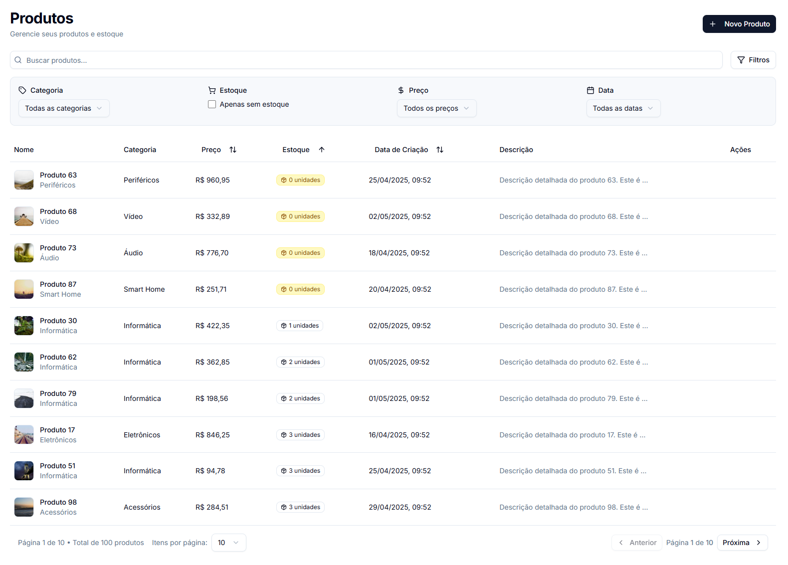

# Documentação do Projeto - Teste Técnico Frontend



## Visão Geral
Este projeto é uma aplicação de gerenciamento de produtos desenvolvida como teste técnico, implementando as funcionalidades solicitadas utilizando Next.js, TypeScript e Tailwind CSS.

## Como Executar o Projeto

### Pré-requisitos
- Node.js (versão 18 ou superior)
- npm ou yarn
- Git

### Passos para Instalação

1. **Clone o repositório**
   ```bash
   git clone git@github.com:braga-academy/produtos-next.git
   cd produtos-next
   ```

2. **Instale as dependências**
   ```bash
   npm install
   # ou
   yarn install
   ```

3. **Inicie o servidor de desenvolvimento**
   ```bash
   npm run dev
   # ou
   yarn dev
   ```
   O projeto estará disponível em `http://localhost:3005`

### Executando os Testes

1. **Testes Unitários**
   ```bash
   npm run test
   # ou
   yarn test
   ```

2. **Testes E2E**
   ```bash
   npm run test:e2e:headless
   # ou
   yarn test:e2e:headless
   ```

### Build de Produção

1. **Gerar build**
   ```bash
   npm run build
   # ou
   yarn build
   ```

2. **Iniciar em modo produção**
   ```bash
   npm run start
   # ou
   yarn start
   ```

## Requisitos Implementados

### Funcionalidades Obrigatórias
1. **Listagem de Produtos**
   - Exibição de nome, preço, descrição e imagem
   - Implementado com TanStack Table para melhor performance e funcionalidades avançadas

2. **Cadastro de Produtos**
   - Formulário com validação usando React Hook Form e Zod
   - Campos: Nome, Preço, Descrição e URL da Imagem
   - Integração com estado global para atualização imediata da lista

3. **Filtros e Ordenação**
   - Busca por nome do produto
   - Filtro por faixa de preço
   - Ordenação dos resultados por diferentes campos

### Requisitos Técnicos Atendidos

1. **Next.js com TypeScript**
   - Utilização do App Router
   - Tipagem com TypeScript

2. **Gerenciamento de Estado**
   - Redux Toolkit para estado global
   - Redux Saga para efeitos colaterais
   - Separação clara entre estado local e global

3. **API Fictícia**
   - Implementação com MSW (Mock Service Worker)
   - Simulação de endpoints RESTful
   - Dados mockados para testes

4. **Estilização**
   - Tailwind CSS para estilização rápida e responsiva
   - Componentes UI com Radix UI e Shadcn/UI
   - Layout responsivo para diferentes dispositivos

### Extras Implementados

1. **Paginação**
   - Implementada na listagem de produtos
   - Controle de itens por página
   - Navegação intuitiva

2. **Layout Responsivo**
   - Design adaptativo para mobile e desktop
   - Breakpoints otimizados
   - Experiência consistente em diferentes dispositivos

3. **Testes**
   - Testes unitários com Jest
   - Testes E2E com Cypress
   - Teste de snapshot de tela implementado

## Estrutura do Projeto

```
src/
├── app/          # Rotas e páginas (Next.js App Router)
├── components/   # Componentes reutilizáveis
├── core/         # Lógica de negócio central
├── features/     # Funcionalidades específicas
├── lib/          # Utilitários e configurações
└── mocks/        # Dados mockados para testes
```

## Scripts Disponíveis

- `npm run dev`: Inicia o servidor de desenvolvimento na porta 3005
- `npm run build`: Gera build de produção
- `npm run test`: Executa testes unitários
- `npm run test:e2e:headless`: Executa testes E2E

## Conclusão

Este projeto atende a todos os requisitos solicitados no teste técnico, implementando as funcionalidades obrigatórias e extras de forma organizada e seguindo as melhores práticas de desenvolvimento frontend. A arquitetura escolhida permite fácil manutenção e escalabilidade do código.
